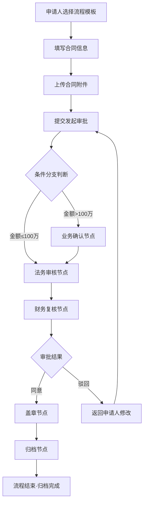

## 1. 产品概述

合同审批工作流编排系统，为法务团队提供从合同起草到归档的全流程规范化管理平台。通过可视化流程设计器、多角色协同工作台和智能统计分析，提升合同审批效率，降低合规风险。

- **核心价值**：规范合同审批流程、提升法务工作效率、实现全流程可追溯、提供数据决策支持
- **目标用户**：法务团队、业务申请人、部门审批人、财务人员、高层管理者

## 2. 核心功能

### 2.1 用户角色

| 角色 | 注册方式 | 核心权限 |
|------|----------|----------|
| 系统管理员 | 系统预置 | 流程配置、节点管理、模板管理、用户权限、系统设置 |
| 申请人 | 管理员分配 | 发起合同流程、上传附件、查看进度、催办审批、查看归档 |
| 审批人 | 管理员分配 | 同意/驳回审批、加签转办、填写修改意见、查看审批历史 |
| 管理者 | 管理员分配 | 统计看板、按部门/金额/耗时分析、异常节点监控、导出报表 |

### 2.2 功能模块

1. **流程设计器**：可视化拖拽设计审批节点、条件分支、办理人配置、时限设置、必填材料配置
2. **合同工作台**：待办审批、已办合同、我发起的、合同列表、发起新流程
3. **审批详情**：合同基本信息、附件预览、审批流程进度、审批操作（同意/驳回/加签）、修改意见
4. **模板中心**：合同模板分类、模板预览、模板下载、版本管理、使用统计
5. **归档查询**：已归档合同检索、多条件筛选、合同详情查看、归档日志
6. **统计分析**：部门效率分析、金额分布统计、流程耗时分析、异常节点预警

### 2.3 页面详情

| 页面名称 | 模块名称 | 功能描述 |
|----------|----------|----------|
| 流程设计器 | 节点工具栏 | 提供起草、业务确认、法务审核、财务复核、盖章、归档、条件分支等节点拖拽组件 |
| 流程设计器 | 画布区域 | 可视化流程画布，支持节点拖拽、连线、选择、删除 |
| 流程设计器 | 属性配置面板 | 节点名称、办理人（指定角色/指定人员/上级领导）、时限（小时/天）、必填材料、条件表达式 |
| 流程设计器 | 流程列表 | 已保存流程模板的列表，支持创建、编辑、删除、启用/禁用 |
| 合同工作台 | 快速发起 | 选择流程模板、填写合同基本信息、上传附件 |
| 合同工作台 | 待办审批 | 待我审批的合同列表，显示节点名称、紧急程度、剩余时限 |
| 合同工作台 | 合同跟踪 | 我发起的合同列表，显示当前节点、进度状态、支持催办 |
| 合同工作台 | 已办列表 | 我已处理的审批历史记录 |
| 审批详情 | 合同信息卡片 | 合同名称、金额、类型、发起部门、发起时间、紧急程度 |
| 审批详情 | 附件预览区 | 合同附件列表、在线预览、下载 |
| 审批详情 | 审批时间线 | 已完成节点的审批记录时间线展示 |
| 审批详情 | 当前节点操作区 | 同意/驳回按钮、加签功能、修改意见输入框 |
| 审批详情 | 流程进度条 | 所有节点的图形化进度展示 |
| 模板中心 | 模板分类导航 | 按合同类型分类（采购合同、销售合同、服务合同、劳动合同等） |
| 模板中心 | 模板卡片列表 | 模板名称、版本、最近更新时间、使用次数 |
| 模板中心 | 模板预览弹窗 | 模板内容预览、字段说明、下载按钮 |
| 归档查询 | 高级筛选 | 按合同编号、名称、金额范围、归档日期、部门多条件筛选 |
| 归档查询 | 归档列表 | 已归档合同列表，支持查看详情、导出 |
| 统计分析 | 概览卡片 | 总合同数、平均审批时长、异常流程数、当月完成数 |
| 统计分析 | 部门效率排行 | 各部门平均审批耗时、完成量柱状图 |
| 统计分析 | 金额分布饼图 | 按金额区间的合同数量占比 |
| 统计分析 | 节点耗时热力图 | 各审批节点平均耗时热力图 |
| 统计分析 | 异常节点预警 | 超时节点、驳回次数多的节点预警列表 |

## 3. 核心流程

## 4. 用户界面设计

### 4.1 设计风格
- **主色调**：深靛蓝 `#1E3A5F`（专业、稳重、法律行业属性）
- **辅助色**：金色 `#C9A962`（高端、权威），翠绿 `#10B981`（通过），橙红 `#EF4444`（驳回/警告）
- **中性色**：灰阶系列（象牙白背景 `#FAFAF7`，深灰文字 `#1F2937`）
- **按钮风格**：微圆角（8px），主按钮带轻微阴影，悬停时浮起效果
- **字体选择**：标题使用 Noto Serif SC（衬线体体现专业权威），正文使用 Noto Sans SC（易读性）
- **布局风格**：左侧导航栏 + 顶部用户栏 + 主内容区的经典三栏布局，卡片式设计，内容区块有细致的边框和阴影
- **图标风格**：Lucide 线性图标，统一 20px 尺寸，配合微动画
- **质感细节**：纸张纹理背景、金色细线分隔、卡片悬浮时微弱的抬升效果

### 4.2 页面设计概览

| 页面名称 | 模块名称 | UI 元素 |
|----------|----------|---------|
| 流程设计器 | 画布区 | 节点卡片带金色边框，连接线使用贝塞尔曲线，选中节点带靛蓝发光效果，拖放时有阴影过渡动画 |
| 合同工作台 | 合同卡片 | 左侧靛蓝色条标识合同类型，右上角紧急程度标签（红/橙/灰），底部进度条微动画 |
| 审批详情 | 时间线 | 竖线连接节点圆点，已完成节点填充绿色带对勾图标，当前节点靛蓝脉冲动画，待办节点灰色空心 |
| 模板中心 | 模板卡片 | 仿文档折角效果，悬停时卡片微微上翘并显示操作按钮组，金色边框装饰角 |
| 统计分析 | 图表区 | 图表配色与主色调一致，数据卡片带渐变背景，关键指标数字有递增动画 |

### 4.3 响应式设计
- 桌面端优先设计（1440px 基准宽度）
- 1024px-1440px：布局自适应缩放，侧边栏保持完整
- 768px-1024px：侧边栏可折叠为图标模式
- <768px：顶部导航，内容区单列堆叠

### 4.4 动效设计
- 页面切换：内容区渐入 + 轻微上移（200ms ease-out）
- 卡片交互：悬停时 translateY(-2px) + box-shadow 增强（150ms）
- 流程进度：节点状态变更时脉冲发光动画
- 数据加载：骨架屏 pulse 动画，数据就绪后 fade-in
