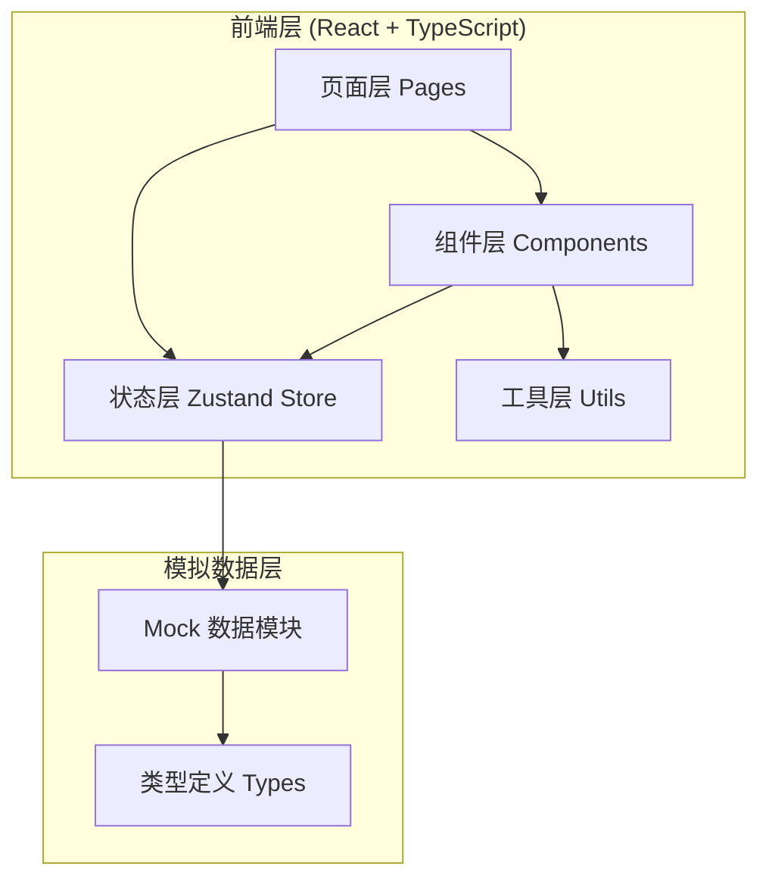

## 1. 架构设计



## 2. 技术描述

- **前端框架**：React@18 + TypeScript + Vite
- **路由管理**：react-router-dom@6
- **状态管理**：zustand
- **样式方案**：TailwindCSS@3
- **图标库**：lucide-react
- **图表库**：recharts
- **后端**：无（纯前端 + Mock 数据模拟）
- **数据持久化**：localStorage

## 3. 路由定义

| 路由 | 页面 | 说明 |
|------|------|------|
| / | Dashboard | 工作台首页，显示待办统计和快速入口 |
| /workbench | ContractWorkbench | 合同工作台，待办/已办/我发起的列表 |
| /designer | ProcessDesigner | 流程设计器，可视化配置审批流程 |
| /approval/:id | ApprovalDetail | 审批详情页，指定合同 ID |
| /templates | TemplateCenter | 模板中心，合同模板管理 |
| /archive | ArchiveSearch | 归档查询，历史合同检索 |
| /analytics | Statistics | 统计分析，数据看板 |

## 4. 类型定义

```typescript
// 流程节点类型
type NodeType = 'start' | 'draft' | 'business_confirm' | 'legal_review' | 'financial_review' | 'stamp' | 'archive' | 'condition' | 'end';

interface WorkflowNode {
  id: string;
  type: NodeType;
  name: string;
  x: number;
  y: number;
  assigneeType: 'role' | 'user' | 'supervisor' | 'auto';
  assignees: string[];
  timeLimit: number;
  timeUnit: 'hour' | 'day';
  requiredMaterials: string[];
  conditionExpression?: string;
}

interface WorkflowConnection {
  id: string;
  from: string;
  to: string;
  label?: string;
  condition?: string;
}

interface WorkflowTemplate {
  id: string;
  name: string;
  description: string;
  nodes: WorkflowNode[];
  connections: WorkflowConnection[];
  enabled: boolean;
  createdAt: string;
  updatedAt: string;
}

// 合同相关
type ContractStatus = 'draft' | 'pending' | 'approved' | 'rejected' | 'archived';
type ContractType = 'purchase' | 'sales' | 'service' | 'labor' | 'other';
type Priority = 'low' | 'medium' | 'high' | 'urgent';

interface ContractAttachment {
  id: string;
  name: string;
  size: number;
  uploadTime: string;
  uploader: string;
  fileType: string;
}

interface ApprovalRecord {
  nodeId: string;
  nodeName: string;
  approverId: string;
  approverName: string;
  action: 'approve' | 'reject' | 'sign' | 'transfer';
  opinion: string;
  time: string;
}

interface Contract {
  id: string;
  code: string;
  name: string;
  type: ContractType;
  amount: number;
  status: ContractStatus;
  priority: Priority;
  workflowId: string;
  currentNodeId: string;
  applicantId: string;
  applicantName: string;
  department: string;
  createTime: string;
  expectedArchiveTime: string;
  actualArchiveTime?: string;
  attachments: ContractAttachment[];
  approvalHistory: ApprovalRecord[];
}

// 合同模板
interface ContractTemplate {
  id: string;
  name: string;
  type: ContractType;
  version: string;
  description: string;
  fileName: string;
  fileSize: number;
  usageCount: number;
  lastUpdated: string;
  enabled: boolean;
}

// 统计数据
interface DepartmentStats {
  department: string;
  totalContracts: number;
  avgDuration: number;
  completedCount: number;
  rejectedCount: number;
}

interface NodeEfficiency {
  nodeName: string;
  avgDuration: number;
  totalCount: number;
  timeoutCount: number;
  rejectionRate: number;
}

interface AmountDistribution {
  range: string;
  count: number;
  totalAmount: number;
}
```

## 5. 数据模型（Mock 数据结构）

### 5.1 Store 结构

```typescript
interface AppStore {
  // 用户
  currentUser: User;
  // 流程
  workflows: WorkflowTemplate[];
  activeWorkflowId: string | null;
  // 合同
  contracts: Contract[];
  // 模板
  templates: ContractTemplate[];
  // 操作
  setActiveWorkflow: (id: string | null) => void;
  addWorkflow: (wf: WorkflowTemplate) => void;
  updateWorkflow: (id: string, data: Partial<WorkflowTemplate>) => void;
  deleteWorkflow: (id: string) => void;
  addContract: (contract: Contract) => void;
  updateContract: (id: string, data: Partial<Contract>) => void;
  addApprovalRecord: (contractId: string, record: ApprovalRecord) => void;
}
```

## 6. 核心目录结构

```
src/
├── components/           # 公共组件
│   ├── layout/          # 布局组件（Sidebar、TopBar、PageContainer）
│   ├── workflow/        # 流程相关组件（NodeCard、ConnectionLine、PropertyPanel）
│   ├── contract/        # 合同相关组件（ContractCard、AttachmentList、Timeline）
│   ├── common/          # 通用组件（Button、Modal、Tag、EmptyState）
│   └── charts/          # 图表组件
├── pages/               # 页面组件
│   ├── Dashboard.tsx
│   ├── ContractWorkbench.tsx
│   ├── ProcessDesigner.tsx
│   ├── ApprovalDetail.tsx
│   ├── TemplateCenter.tsx
│   ├── ArchiveSearch.tsx
│   └── Statistics.tsx
├── store/               # Zustand 状态管理
│   └── useAppStore.ts
├── types/               # TypeScript 类型定义
│   └── index.ts
├── utils/               # 工具函数
│   ├── helpers.ts
│   ├── constants.ts
│   └── mockData.ts
├── App.tsx
├── main.tsx
└── index.css
```
